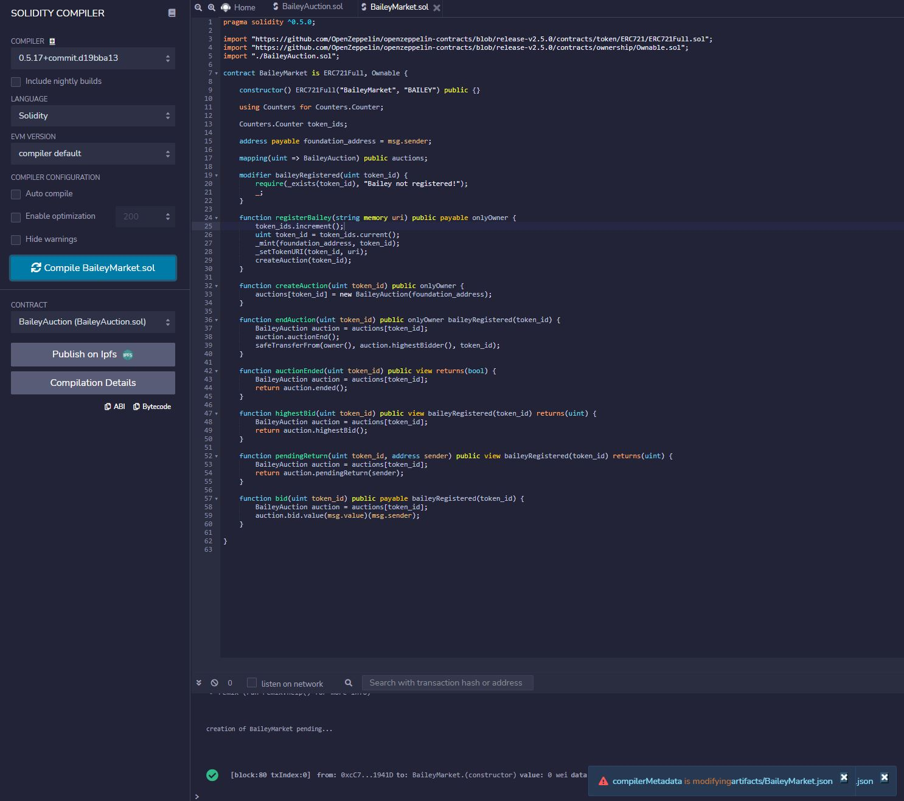
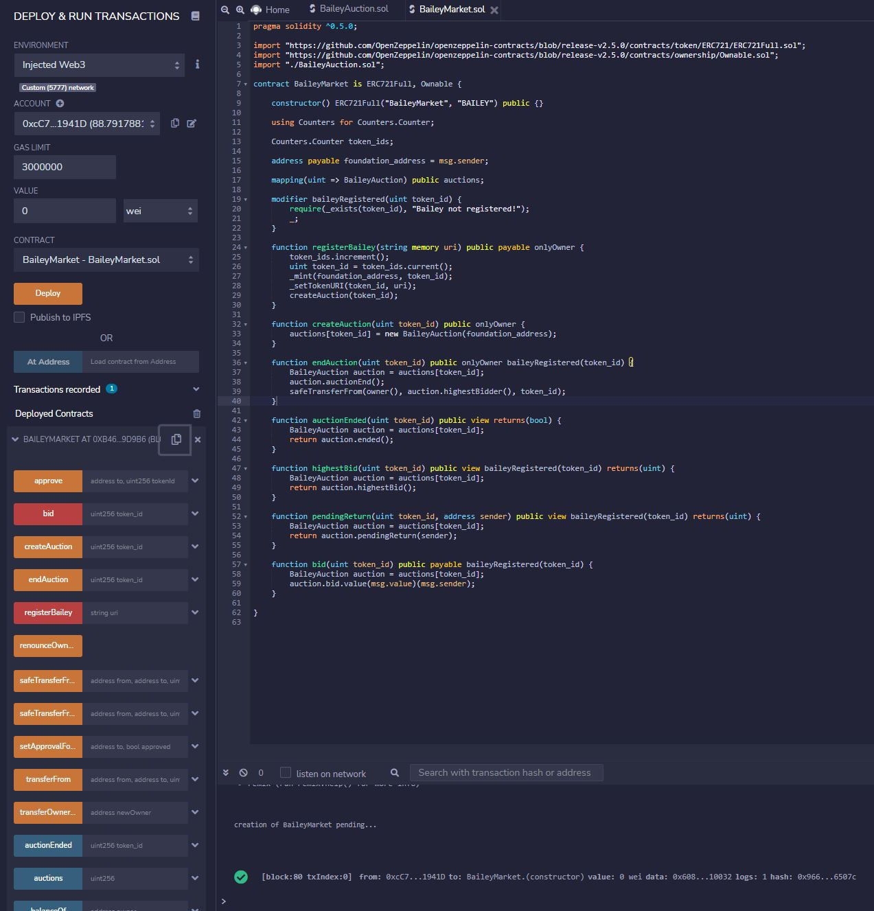
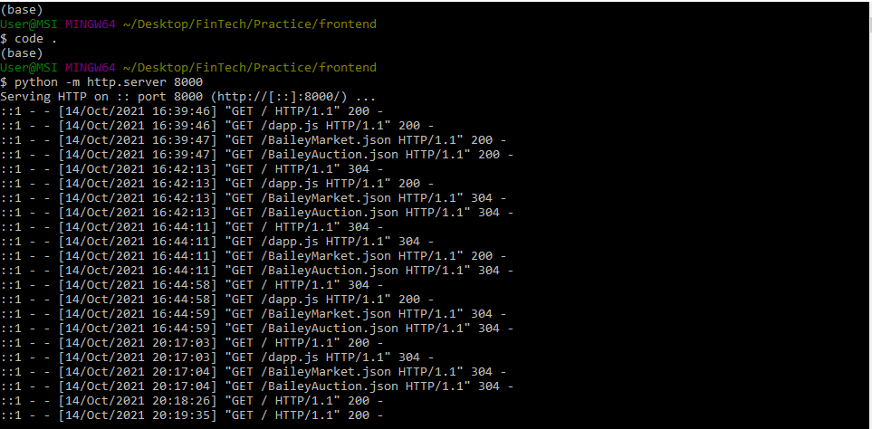
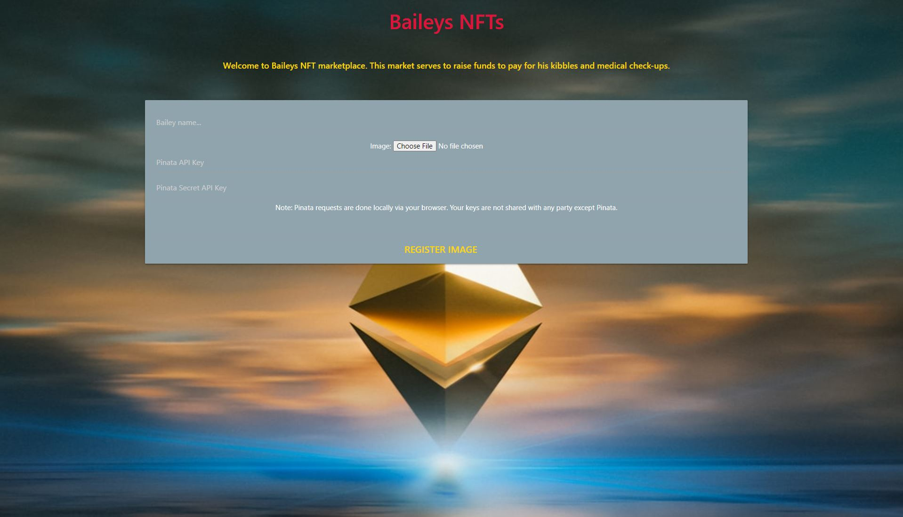
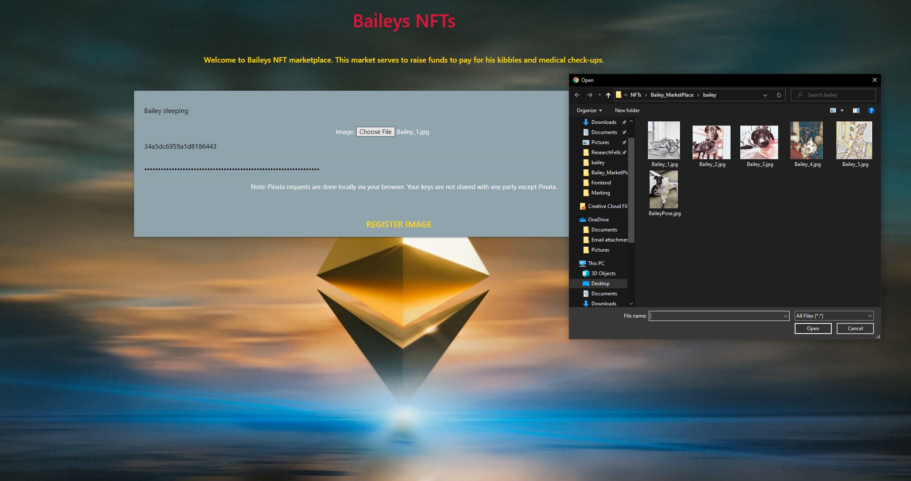
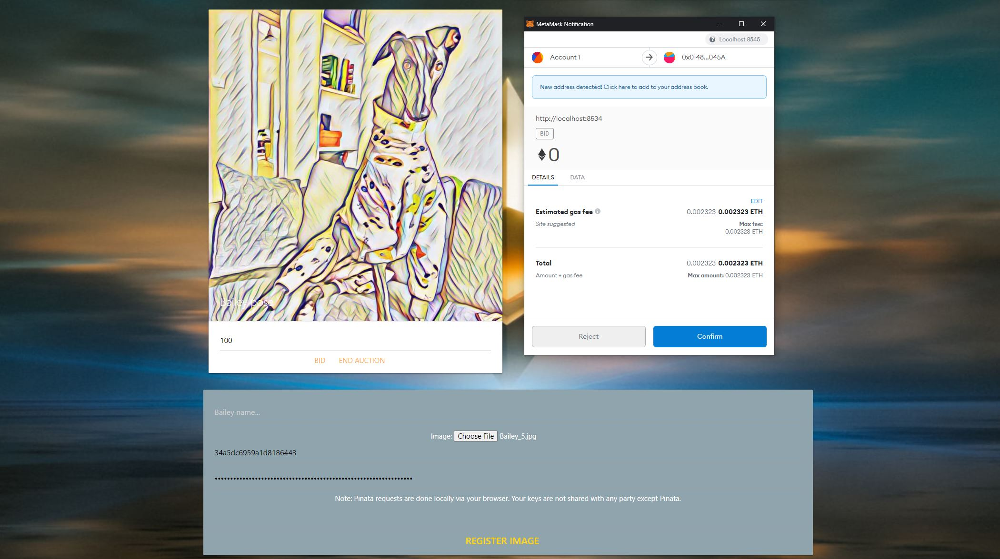

# LOSTt Bulls :ox:
#### Authored by: [Luke](https://github.com/lukekonsta7), [Oliver](https://github.com/OliverGeddes), [Scott](https://github.com/Bomegolf), [Tom](https://github.com/kez4twez), and [Thapa](https://github.com/TribThapa)

&nbsp;

## Project Overview
Our project aimed to create Non-Fungible Tokens (NFTs) using our beloved Greyhound - Bailey's images. We launched Bailey's images in a market place where you could bid for an NFT of your choosing whilst funding Bailey's kibbles and medical check-ups. A win(k)-win(k)! :wink:
 

&nbsp;

## The images below highlight steps involved in creating and launching Bailey's NFT in a marketplace

#### Step 1: Compile SmartContracts on [Remix](https://remix.ethereum.org/#optimize=false&runs=200&evmVersion=null&version=soljson-v0.8.7+commit.e28d00a7.js)

&nbsp;

#### Step 2: Deploy SmartContracts on [Remix](https://remix.ethereum.org/#optimize=false&runs=200&evmVersion=null&version=soljson-v0.8.7+commit.e28d00a7.js)

&nbsp;

#### Step 3: Launch Server using Python

&nbsp;

#### Step 4: Connect MarketPlace with MetaMask

&nbsp;

#### Step 5: Set Marketplace

&nbsp;

#### Step 6: Upload Image 

&nbsp;

#### Step 7: Create marketplace with NFTs

&nbsp;

#### Step 8: Make bid and confirm transaction

## Sources
- [Bailey Instagram](https://www.instagram.com/bailey_the_greyt/)
- [Emojis](https://github.com/ikatyang/emoji-cheat-sheet#animals--nature)
- [IPFS](https://ipfs.io/)
- [Metamask](https://metamask.io/)
- [Remix](https://remix.ethereum.org/#optimize=false&runs=200&evmVersion=null&version=soljson-v0.8.7+commit.e28d00a7.js)