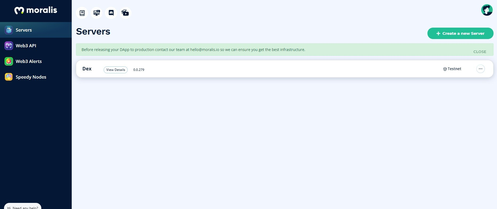
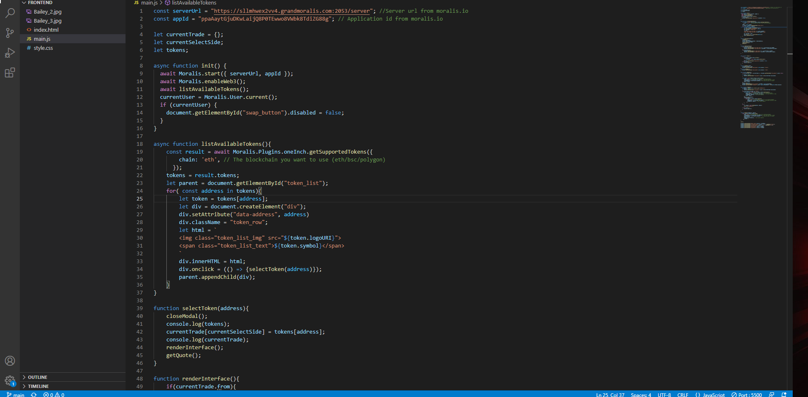
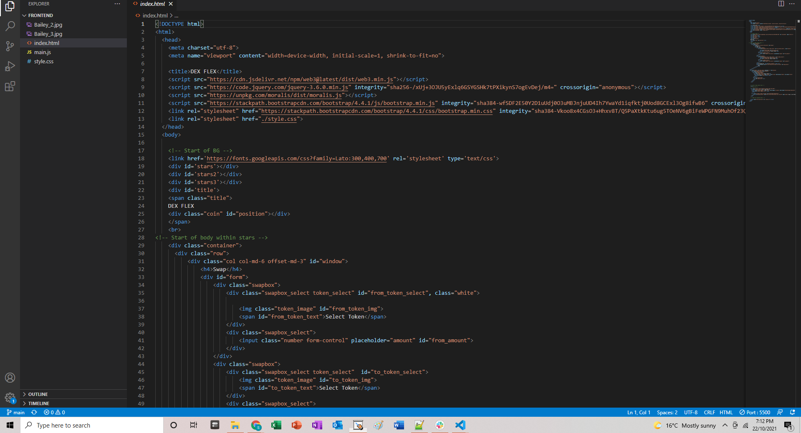

# LOSTt Bulls :ox:
#### Authored by: [Luke](https://github.com/lukekonsta7), [Oliver](https://github.com/OliverGeddes), [Scott](https://github.com/Bomegolf), [Tom](https://github.com/kez4twez), and [Thapa](https://github.com/TribThapa)

&nbsp;

# Project Overview
Our project aimed to create a Decentralised Exchange (Dex) to swap cryptocurrency.

&nbsp;

## The images below highlight the steps involved in creating and launching DexFlex

Step 1: Geneterate a Moralis Server

&nbsp;

Step 2: Add Moralis.io plugins

&nbsp;

Step 3: Install 1inch Plugin

&nbsp;

Step 4: Connect Server to dAapp's main.js file

Copy Server URL:

Copy Appilcation ID:

&nbsp;

Step 5: Encrypt Url and Application ID into main.js

&nbsp;

Example of main.js file for DexFlex

&nbsp;

Step 6: Code index.html for DexFlex to swap coins

&nbsp;

Step 7: Code style.css to create frontend interface for DexFlex

&nbsp;

Step 8: Deploy DexFlex

&nbsp;

Step 9: Connect to MetaMask

&nbsp;

Step 10: Select coins to swap

&nbsp;

&nbsp;

Step 11: Check value of one coin for another

&nbsp;

Step 12: Confirm swap i.e., decentralised exchange

&nbsp;

## Sources
- [DEX Tutorial](https://www.youtube.com/watch?v=XOvtnDx1m5c&ab_channel=MoralisWeb3)
- [Moralis](https://moralis.io/?utm_source=youtubemoralis&utm_medium=video&utm_campaign=XOvtnDx1m5c)
- [Repo](https://github.com/MoralisWeb3/demo-apps/tree/main/dex-tutorial)
- [PlugIns](https://moralis.io/plugins/)